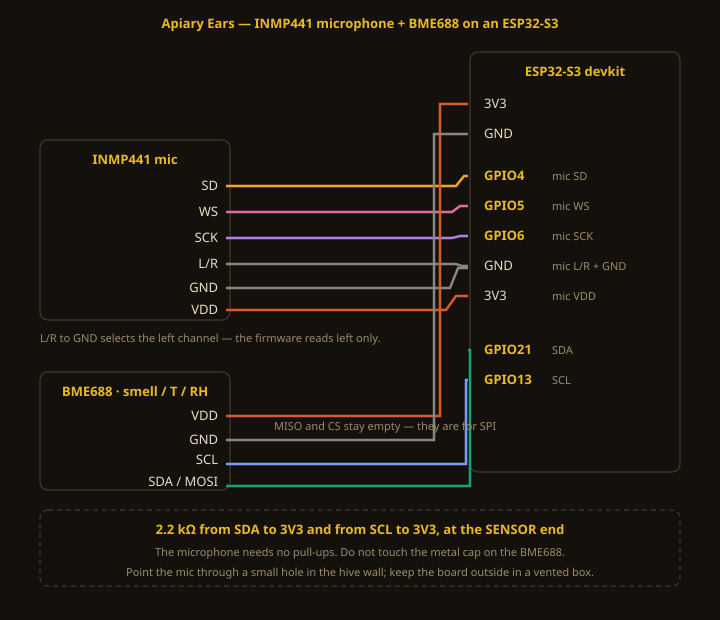

# Apiary Ears

**Listening to a colony and smelling it at the same time, to find out whether a swarm
announces itself before it goes.**

An ESP32-S3, an INMP441 microphone inside the hive, and a Bosch BME688 beside it. The board
scores what it hears every two seconds, records events on its own, and serves its own web
page. No broker, no database, no server, no account.

## Why both sensors

Beekeepers already listen. You put an ear to the box and you know something. A colony
preparing to swarm changes how it sounds days before it leaves — more fanning, more
agitation — and in the final day or two the queens pipe, which is unmistakable once heard.

Smell is not an extra here, it is the other half. The two move on **different clocks**:

- **Sound changes in minutes.** A knock, a wasp, a disturbance, piping.
- **Smell changes over hours and days.** Brood, nectar coming in, something decaying.

So a score spike with no movement in the fingerprint is probably a lawnmower. A spike where
both move is a colony doing something. One board watches both, on one chart, which is the
whole argument for this build.

## What it does

**Three ways to capture, because different things need different ones:**

- **Live listen** — stream the hive to your browser. The thing you already do, without
  opening the box.
- **Record** — press a button, get a ten-second WAV with your label on it.
- **Automatic events** — the board watches its own score and records whenever the colony is
  unusual *for this hive*, keeping the frequency breakdown, the ten-step smell fingerprint,
  the temperature and how fast it is changing.

The page also shows the **fingerprint over time** as a spectrogram, groups **recurring
patterns** automatically, lists the **recordings held on the board** with how much flash is
left, and has a **Node panel** giving uptime, temperature, rail voltage and a per-input diagnosis
with the steps to fix whatever is unhappy — plus a self-check button that re-probes
everything after you change a cable, and a restart button.

**Every event is scored** so events can be compared between hives and between apiaries:
0–100, built from fanning (60–180 Hz), agitation (225–315 Hz), piping (360–500 Hz) and an
environment term from the smell and the temperature trend. Everything is measured against
*that hive's own rolling baseline*, so a loud apiary and a quiet one are comparable.

## The score is a hypothesis, not a prediction

The weights come from published descriptions of pre-swarm acoustics, not from validated
measurement on this hardware. They may be wrong. That is why **every event stores its raw
band deviations in dB and its raw fingerprint in kΩ** — if the weights are wrong, or someone
trains something better, the same events can be re-scored without re-recording anything.

And a high score is not a swarm. An inspection, a mower, a thunderstorm and a wasp raid all
raise it. That is why events carry a note field, and why annotating them is the single most
valuable thing a contributor does.

## Build one

| doc | covers |
|---|---|
| [WIRING.md](docs/WIRING.md) | ten wires, two resistors, where each sensor sits in the hive |
| [BUILD.md](docs/BUILD.md) | IDE setup, the two libraries, flashing, what to check first |
| [USAGE.md](docs/USAGE.md) | recording, reading the page, the API |
| [SCORING.md](docs/SCORING.md) | exactly how the score works, and its limits |
| [CLIPS.md](docs/CLIPS.md) | sharing recordings: the event vocabulary, and why the WAV is the contribution |

About $40 in parts. An afternoon.

## Contribute recordings

What would make this project real:

- **Events with notes.** "Inspection", "mower next door", "nothing — I was there and they
  were calm." All three are valuable.
- **Ordinary days.** A week of a colony doing nothing is the baseline everything else is
  measured against.
- **A swarm.** If you catch one, the recording either side of it is the most valuable file
  this project could receive. Nobody has published such a thing.

Export from the page, validate with `python tools/validate.py yourfile.json`, and open a
pull request or attach it to a [submission issue](../../issues/new?template=recording.yml).

## Related

[**Apiary Nose**](https://github.com/winreboot/apiary-nose) — the same BME688 on its own,
building an open dataset of what hives smell like. If you only want smell, start there; this
project is what happens when you put a microphone next to it.

## Licence

Code MIT. Contributed recordings CC BY 4.0 — use them, credit the apiary they came from.
